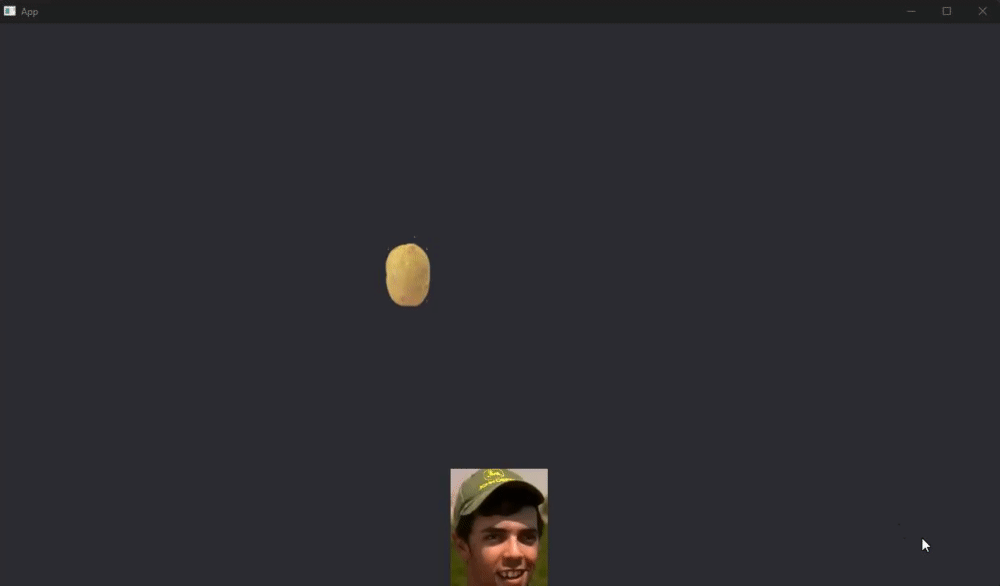

# Potato Catcher

This is a Rust project that uses the Bevy game engine to create a game featuring a character named "Potato Man". 
The game is about catching falling potatoes.



## Getting Started

### Prerequisites

You need to have Rust and Cargo installed on your machine. You can download and install them from the official [Rust website](https://www.rust-lang.org/tools/install).

### Installing

Clone the repository to your local machine:

```bash
git clone https://github.com/jackinf/potato-catcher.git
```

Navigate to the project directory:

```bash
cd potato-catcher
```

Build the project:

```bash
cargo build
```

Run the project:

```bash
cargo run
```

## Project Structure

The project is structured into several systems, each handling a specific aspect of the game:

- `potato_man_record_movement.rs`: This system records the Potato Man's movements based on keyboard inputs.
- `potato_falling.rs`: This system handles the falling potatoes in the game.
- `potato_man_perform_movement.rs`: This system performs the Potato Man's movements based on the recorded inputs.

## Built With

- [Rust](https://www.rust-lang.org/) - The programming language used.
- [Cargo](https://doc.rust-lang.org/cargo/) - The Rust package manager.
- [Bevy](https://bevyengine.org/) - A simple, data-driven game engine built in Rust.

## Authors

- **jackinf** 

## License

This project is licensed under the MIT License - see the [LICENSE.md](LICENSE.md) file for details.

## Acknowledgments

- Thanks to the Bevy community for the great game engine.
- Thanks to the Rust community for the great programming language.