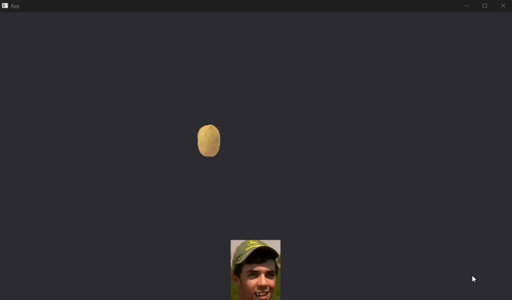

<div align="center">

# Potato Catcher

### A Bevy game where Potato Man catches falling potatoes

[](https://www.rust-lang.org/)
[](https://bevyengine.org/)
[](https://webassembly.org/)
[](https://go.dev/)
[](https://www.docker.com/)
[](https://cloud.google.com/run)
[](https://github.com/jackinf/potato-catcher)

</div>

## Overview

Potato Catcher is a small 2D game built in Rust with the [Bevy](https://bevyengine.org/) engine.
You control a character named "Potato Man" and catch potatoes as they fall from the top of the
screen, racking up a score as you go. The game runs natively via Cargo, or it can be compiled to
WebAssembly and served in the browser through a lightweight Go static file server, with deployment
wired up for Google Cloud Run.



## Features

- Catch falling potatoes by moving Potato Man left and right.
- Live score tracking via an on-screen counter.
- Sprite and audio assets (Potato Man, potatoes, catch/harvest sounds).
- Timer-driven potato spawning with randomized positions.
- Runs natively or in the browser via a WebAssembly build.
- Containerized Go web server for serving the WASM build, deployable to Google Cloud Run.

## Tech Stack

| Area | Technology |
| --- | --- |
| Game engine | [Bevy](https://bevyengine.org/) `0.13.2` |
| Language | [Rust](https://www.rust-lang.org/) (edition 2021) |
| Randomization | [`rand`](https://crates.io/crates/rand) `0.8.5` |
| Web target | WebAssembly (`wasm32-unknown-unknown`, `wasm-bindgen`) |
| Web server | [Go](https://go.dev/) `1.22` static file server |
| Packaging / deploy | Docker, Google Cloud Run, Google Cloud Storage |

## Getting Started

### Prerequisites

- [Rust and Cargo](https://www.rust-lang.org/tools/install) installed on your machine.

### Installation

Clone the repository and enter the project directory:

```bash
git clone https://github.com/jackinf/potato-catcher.git
cd potato-catcher
```

### Running

Build and run the game natively:

```bash
cargo build
cargo run
```

### Building for the Web (WebAssembly)

The game can be compiled to WASM and served in the browser. Install the `wasm-bindgen` CLI,
build the WASM target, and generate the web bindings:

```bash
cargo install wasm-bindgen-cli
cargo build --target wasm32-unknown-unknown --release
wasm-bindgen target/wasm32-unknown-unknown/release/potato-catcher.wasm --out-dir out --web
```

The `Makefile` provides a `wasm-build` target that wraps these steps and copies the generated
files into `static/`. The Go server (`main.go`) serves the `static/` directory on port `8080`
with the correct MIME types for `.wasm` and audio assets:

```bash
go build -o main .
./main
```

For full cloud deployment to Google Cloud Run (bucket setup, Docker build/push, and
`gcloud run deploy`), see [`Deployment.md`](Deployment.md) and the targets in the `Makefile`.

## Project Structure

```
potato-catcher/
├── src/
│   ├── main.rs           # App entry point / Bevy setup
│   ├── components/       # ECS components (potato, potato_man, score_text, ...)
│   ├── resources/        # Game resources (score, spawn timer)
│   └── systems/          # Game systems (spawn, movement, collision, falling)
├── assets/               # Sprites, fonts, and sound effects
├── static/               # WASM build output and web frontend (index.html, JS)
├── main.go               # Go static file server for the web build
├── Dockerfile            # Container image for the web server
├── Makefile              # WASM build + GCP Cloud Run deployment targets
├── Deployment.md         # Detailed deployment guide
└── Cargo.toml            # Rust crate manifest
```
